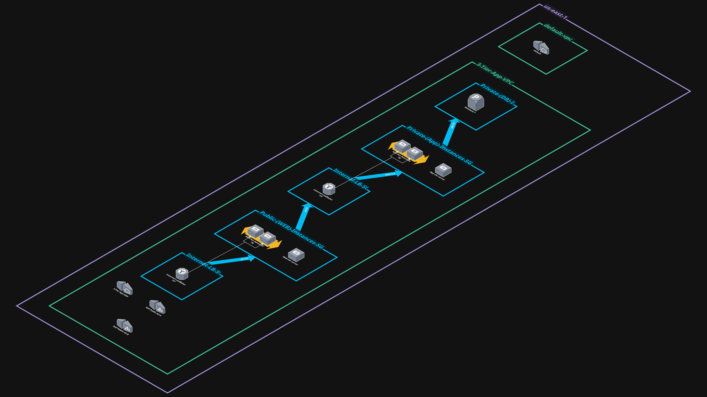

## AWS Three-Tier Web Architecture Deployment
A fully deployed, secure, and scalable three-tier application on AWS, built from scratch.

# Overview
This project demonstrates the deployment of a three-tier architecture consisting of:

Web Tier – Internet-facing EC2 instances behind a public Application Load Balancer.

App Tier – Private EC2 instances behind an internal Load Balancer.

Database Tier – Amazon RDS MySQL instance in private subnets.

# Services Used
Amazon EC2 – Web and App tiers

Elastic Load Balancing – Public & internal load balancers

Amazon RDS (MySQL) – Managed relational database

Amazon VPC – Custom networking, 5 subnets (public & private)

Security Groups & NACLs – Network security

IAM – Role-based access control

Cloudcraft – Architecture diagram

# Architecture Diagram

3-Tier-App Architect

CloudCraft Architecture Diagram: 3D view of the deployed AWS infrastructure.

# Deployment Steps

### Networking

Created a VPC with 5 subnets (public & private).

Attached an Internet Gateway and configured route tables.

### Web Tier

Launched EC2 instances in public subnets.

Configured an Internet-facing ALB.

### App Tier

Launched EC2 instances in private subnets.

Connected via an internal ALB from the web tier.

### Database Tier

Created an RDS MySQL instance in private subnets.

Restricted access to App tier only.

### Security

Configured SGs to allow only necessary traffic (HTTP/HTTPS/MySQL).

Used IAM roles for EC2 and Cloudcraft integration.

# Screenshots
See /screenshots for the running application and AWS console views.

# Lessons Learned
Difference between internal and internet-facing load balancers.

How private subnets secure backend services.

Troubleshooting security group & networking issues.
