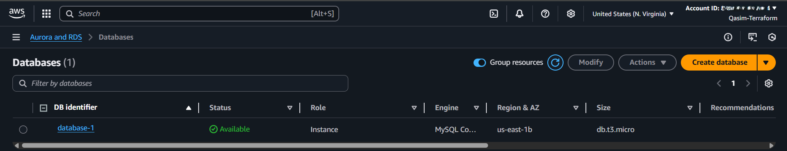

# Project Screenshots
This section visually documents the step-by-step deployment of my AWS Three-Tier Web Architecture.
From networking to the final running application, each screenshot highlights a specific part of the infrastructure.
---

## Networking Layer

The foundation of the project — configuring the VPC, subnets, and route tables to enable secure communication between tiers.

---

## Web Tier

The entry point for all user traffic — publicly accessible, secured, and load-balanced.

Web Tier EC2 Instances: Instances serving static and dynamic content.

Web Tier Security Group: Firewall rules controlling inbound HTTP/HTTPS traffic.

Internet-Facing Application Load Balancer: Distributes incoming requests to the web tier.

---

## App Tier

Handles the business logic, isolated from public access, and only reachable through the internal load balancer.

App Tier EC2 Instances: Backend instances processing application requests.

App Tier Security Group: Restricts inbound traffic to only the web tier.

Internal Load Balancer: Routes traffic securely between web tier and app tier.

---

## Database Tier

Secure and private — stores application data, only accessible by the app tier.

RDS Dashboard: Overview of the managed MySQL database instance.

DB Subnet Group: Ensures database redundancy and availability.

DB Security Group: Limits inbound traffic to only the application tier.

---

## Final Working Application
A visual wrap-up showing the completed architecture and the live application.

CloudCraft Architecture Diagram: 3D view of the deployed AWS infrastructure.

Website in Action: Screenshots of the running application.

